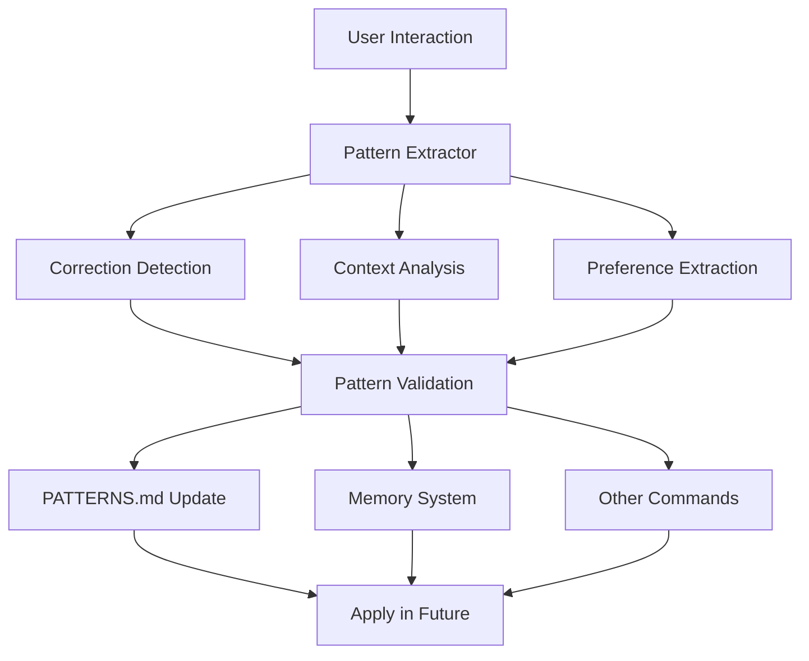

# Enhanced /learn Command - Implementation Summary

## Overview

The enhanced /learn command transforms from a simple rule-capture tool into an intelligent pattern recognition system that builds adaptive knowledge from user interactions.

## Key Enhancements

### 1. **Pattern Recognition Engine**
- **Auto-detects** corrections, preferences, and implicit feedback
- **Categorizes** patterns: Style, Review, Workflow, Communication, etc.
- **Tracks confidence** based on frequency and consistency
- **Context-aware** - understands when patterns apply

### 2. **Integration Components**

#### Files Created:
- `.claude/commands/learn-enhanced.md` - Enhanced command documentation
- `PATTERNS.md` - Living document of learned patterns
- `CONTEXT_AWARENESS.md` - Context detection and adaptation guide
- `.claude/scripts/pattern_extractor.py` - Pattern extraction logic
- `.claude/scripts/update_patterns.py` - Document update automation
- `.claude/scripts/learn_integration.py` - System integration

### 3. **Pattern Extraction Process**



### 4. **Pattern Categories**

| Category | What It Captures | Example |
|----------|------------------|---------|
| **Style** | Code formatting preferences | "Use f-strings not .format()" |
| **Review** | What user checks for | "Always validate auth" |
| **Workflow** | Situational behaviors | "Rush mode = minimal refactoring" |
| **Communication** | How user wants responses | "Be concise when rushing" |
| **Error Recovery** | What fixes work | "This error means X" |

### 5. **Context Awareness**

The system detects and adapts to:
- **Urgency levels**: Emergency → Rush → Normal → Quality
- **Task complexity**: Simple → Complex
- **User state**: Learning → Expert
- **Code context**: Greenfield → Legacy

### 6. **Memory Integration**

```python
# Patterns become memory entities
{
    "name": "F-String Preference",
    "entityType": "Pattern",
    "observations": [
        "User prefers f-strings",
        "Seen 5 times",
        "Applies to Python code",
        "Auto-apply enabled"
    ]
}
```

### 7. **Usage Examples**

#### Automatic Pattern Detection:
```
User: "No, change 'usr' to 'user' - I prefer descriptive names"
System: [AUTO-LEARN] Captured naming preference pattern
```

#### Context Shift Detection:
```
User: "This needs to ship today"
System: [AUTO-LEARN] Detected rush mode context
```

#### Pattern Application:
```
# Before learn:
def calc(usr, val):
    return "Result: {}".format(val)

# After learn (auto-applied patterns):
def calculate(user, value):
    return f"Result: {value}"
```

### 8. **Implementation Workflow**

1. **Detection Phase**
   - Monitor all interactions for patterns
   - Use regex and NLP to find corrections
   - Track what user accepts/modifies

2. **Analysis Phase** (with /think)
   - Why did user want this change?
   - When does this pattern apply?
   - Are there exceptions?

3. **Documentation Phase**
   - Update PATTERNS.md automatically
   - Track confidence levels
   - Note context and exceptions

4. **Application Phase**
   - Check patterns before generating code
   - Apply high-confidence patterns automatically
   - Adapt behavior based on context

5. **Feedback Loop**
   - Track if pattern application succeeds
   - Adjust confidence accordingly
   - Learn from failures

### 9. **Benefits**

- **Reduces repeated corrections** - Learn once, apply forever
- **Adapts to user style** - Code matches preferences
- **Context-appropriate responses** - Right approach for situation
- **Continuous improvement** - Gets better over time
- **Implicit learning** - Captures unspoken preferences

### 10. **Next Steps**

To fully activate the enhanced /learn system:

1. Replace current `/learn` implementation with enhanced version
2. Run initial pattern extraction on recent PRs
3. Set up automatic pattern detection hooks
4. Integrate with memory system
5. Add pattern checking to other commands

The system is designed to be immediately useful while continuously improving through actual usage.
