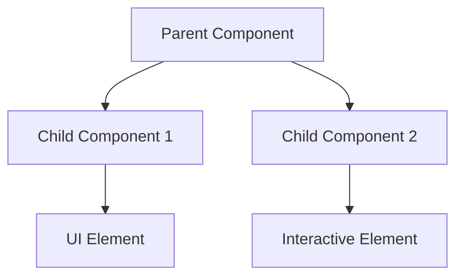

# /design - Product & Engineering Design Documentation

**Purpose**: Generate comprehensive product specification and engineering design documents to prevent implementation failures through proper planning

**Usage**: `/design [feature-name] [--type=feature|bugfix|migration|refactor]` - Creates product spec and engineering design docs in `roadmap/`

**Default Composition**: `/requirements-start /execute /arch /principalproductmanager /principalengineer /tdd /thinku /research [current_date_search]`

🚨 **MANDATORY CURRENT DATE RESEARCH**: Must include fresh internet searches using current date (**$(date +"%B %d, %Y")**) to validate against latest industry trends, frameworks, and best practices. Avoid using outdated research when evaluating modern solutions.
**Parameters**:
- `feature-name`: Name of the feature/component to design
- `--type`: Optional type for customized templates (default: feature)
- Use `$ARGUMENTS` in templates for team customization

## ⚠️ **Selective Documentation Principle**

**SKIP sections that don't apply** - Don't force irrelevant content:
- **Bug fixes**: Skip user stories, focus on technical analysis
- **Infrastructure**: Skip UI/UX, focus on system design
- **Small features**: Skip risk assessment if trivial
- **Internal tools**: Skip user journey maps

**Quality over completeness** - Empty sections with good reason > Forced placeholder content

### **Section Relevance by Type**
- **Features**: Full product spec + engineering design
- **Bug fixes**: Focus on technical analysis, testing strategy, minimal product spec
- **Migrations**: Emphasize risk assessment, rollout plan, minimal UI requirements
- **Refactoring**: Focus on technical goals, success metrics, skip user stories
- **Infrastructure**: System design, monitoring, automation hooks - skip user journeys

## 🎯 Command Objectives

1. **Requirements First**: Start with `/requirements-start` to gather structured requirements through guided questions
2. **Prevent Issues Like React V2**: Enforce proper planning before implementation
3. **Feature Completeness**: Ensure all requirements are captured upfront
4. **Technical Clarity**: Define implementation approach before coding
5. **Success Criteria**: Clear definition of "done" before starting
6. **Methodology Enforcement**: Mandate /4layer, /tdd, /redgreen for quality
7. **Multi-Perspective Validation**: Combine architecture analysis with principal-level product and engineering expertise  
8. **Current Industry Standards**: Validate approach against 2025 best practices and emerging technologies
9. **TDD Implementation Planning**: Generate detailed sub-milestone breakdown with test-driven development integration
10. **Granular Progress Tracking**: Break features into ~100 line commits for better tracking and rollback safety

## 📋 Requirements Gathering Integration

The `/design` command now starts with `/requirements-start` to ensure comprehensive requirements are captured before creating design documents:

1. **Discovery Phase**: 5 yes/no questions to understand the problem space
2. **Context Analysis**: Autonomous codebase analysis to identify technical constraints
3. **Expert Questions**: 5 detailed yes/no questions based on findings
4. **Requirements Spec**: Generated requirements feed into design documents

This ensures design documents are grounded in validated requirements gathered through systematic questioning.

## 🔄 Session Continuity

**Link to Previous Work**: Reference related design decisions, previous sprints, and architectural choices to maintain development continuity across sessions.

**Team Integration**: All documents are git-friendly and can be shared across team members for collaborative development.

## 📋 Generated Documents

The `/design` command now generates **3 comprehensive documents** with TDD integration:

### 1. Product Specification (`roadmap/[feature]_product_spec.md`)

**Structure**:
```markdown
# [Feature] Product Specification

## Table of Contents
1. [Executive Summary](#executive-summary)
2. [Goals & Objectives](#goals--objectives)
3. [User Stories](#user-stories)
4. [Feature Requirements](#feature-requirements)
5. [User Journey Maps](#user-journey-maps)
6. [UI/UX Requirements](#uiux-requirements)
7. [Success Criteria](#success-criteria)
8. [Metrics & KPIs](#metrics--kpis)

## Executive Summary
- Feature overview
- User value proposition
- Success metrics

## Goals & Objectives
### Primary Goals
- Business goal 1: [Measurable outcome]
- Business goal 2: [Measurable outcome]
- User goal 1: [User benefit]
- User goal 2: [User benefit]

### Secondary Goals
- Technical debt reduction
- Performance improvements
- Developer experience

## User Stories
- As a [user type], I want [goal] so that [benefit]
- Acceptance criteria for each story

## Feature Requirements
### Functional Requirements
- Core features list
- User interactions
- Data requirements

### Non-Functional Requirements
- Performance targets
- Security requirements
- Accessibility standards

## User Journey Maps
- New user flow
- Returning user flow
- Edge cases

## UI/UX Requirements
### Visual Component Specifications
- **Component Tree**: Mermaid diagram of component hierarchy
- **Wireframes**: ASCII art or reference to design files
- **State Diagrams**: Visual representation of UI state changes
- **User Flow Diagrams**: Mermaid flowcharts for user journeys
- **Component Library**: Existing components to reuse vs new components needed

### Interface Specifications


### Responsive Behavior
- Mobile breakpoints and layout changes
- Desktop interaction patterns
- Accessibility considerations (keyboard navigation, screen readers)
- Performance targets (load time, interaction responsiveness)

## Success Criteria
- Feature complete checklist
- Performance benchmarks
- User acceptance tests

## Metrics & KPIs
- Adoption rate targets
- Performance baselines
- User satisfaction goals
```

### 2. Engineering Design Document (`roadmap/[feature]_eng_design.md`)

### 3. TDD Implementation Plan (`roadmap/[feature]_implementation_plan.md`) 🆕

**Structure**:
```markdown
# [Feature] TDD Implementation Plan

## Table of Contents
1. [Implementation Overview](#implementation-overview)
2. [Scope & Delta Analysis](#scope--delta-analysis)
3. [Phase Breakdown](#phase-breakdown)
4. [Sub-Milestone Planning](#sub-milestone-planning)
5. [TDD Test Strategy](#tdd-test-strategy)
6. [Git Commit Strategy](#git-commit-strategy)
7. [Progress Tracking](#progress-tracking)
8. [Success Validation](#success-validation)

## Implementation Overview
### Feature Scope
- [Specific feature being implemented]
- [Core functionality requirements]
- [Integration points with existing system]

### Success Criteria
- [ ] All acceptance criteria met
- [ ] Test coverage ≥95%
- [ ] All commits follow TDD pattern
- [ ] Performance benchmarks achieved
- [ ] Documentation complete

## Scope & Delta Analysis
### Lines of Code Estimation
- **New Code**: ~X lines
- **Modified Code**: ~Y lines  
- **Deleted Code**: ~Z lines
- **Total Delta**: ~(X+Y-Z) lines
- **Confidence**: High/Medium/Low

### File Impact Analysis
- **New Files**: [List with estimated lines]
- **Modified Files**: [List with estimated changes]
- **Dependencies**: [External dependencies or constraints]

## Phase Breakdown
### Phase 1: [Phase Name] (~X lines)
**Duration**: [Time estimate]
**Files**: [List of files to be changed]
**Dependencies**: [What must be complete first]

### Phase 2: [Phase Name] (~Y lines)  
**Duration**: [Time estimate]
**Files**: [List of files to be changed]
**Dependencies**: [Phase dependencies]

### Phase 3: [Phase Name] (~Z lines)
**Duration**: [Time estimate]
**Files**: [List of files to be changed]  
**Dependencies**: [Phase dependencies]

## Sub-Milestone Planning
*Each sub-milestone targets ~100 delta lines for granular tracking*

### Phase 1 Sub-Milestones
#### SM1.1: [Milestone Name] (~100 lines)
**Files**: [Specific files and line counts]
**Commit**: `[type](scope): [description]`
**TDD Approach**:
- **Red**: Write failing test for [specific functionality]
- **Green**: Implement minimal code to pass test
- **Refactor**: Clean up implementation
- **Test**: Verify [specific validation criteria]

#### SM1.2: [Milestone Name] (~100 lines)
**Files**: [Specific files and line counts]
**Commit**: `[type](scope): [description]`
**TDD Approach**:
- **Red**: Write failing test for [specific functionality]
- **Green**: Implement minimal code to pass test
- **Refactor**: Clean up implementation  
- **Test**: Verify [specific validation criteria]

### Phase 2 Sub-Milestones
#### SM2.1: [Milestone Name] (~100 lines)
[Similar structure repeated for each sub-milestone]

### Phase 3 Sub-Milestones  
#### SM3.1: [Milestone Name] (~100 lines)
[Similar structure repeated for each sub-milestone]

## TDD Test Strategy
### Red-Green-Refactor Cycle
For each sub-milestone:
1. **Red Phase**: Write failing test that defines expected behavior
2. **Green Phase**: Write minimal code to make test pass  
3. **Refactor Phase**: Improve code quality while keeping tests green
4. **Validation Phase**: Ensure acceptance criteria met

### Test Categories by Sub-Milestone
#### Unit Tests (~X tests per milestone)
- Component rendering tests
- Function logic tests
- Edge case handling
- Error condition tests

#### Integration Tests (~Y tests per milestone)
- API integration tests
- Component interaction tests
- Data flow tests
- State management tests

#### End-to-End Tests (~Z tests per milestone)
- User journey tests
- Feature workflow tests
- Cross-browser tests  
- Performance tests

## Git Commit Strategy
### Commit Message Format
```
[type](scope): [description]

[optional body explaining the change]

TDD: [Red/Green/Refactor phase completed]
Test: [Test validation summary]

Co-Authored-By: Claude <noreply@anthropic.com>
```

### Commit Types by Phase
- `feat`: New feature implementation
- `test`: Test addition/modification
- `refactor`: Code refactoring without behavior change
- `fix`: Bug fixes
- `docs`: Documentation updates
- `chore`: Maintenance tasks

### Branch Strategy
- **Main Branch**: `main` - production ready code
- **Feature Branch**: `[descriptive-name]` or `dev[timestamp]` - development work (no strict format required)
- **Sub-Milestone Commits**: Each ~100 line change is one commit
- **PR Strategy**: One PR per phase (multiple sub-milestones)

## Progress Tracking
### Milestone Checklist
- [ ] SM1.1: [Milestone name] - [Status: Pending/In Progress/Complete]
- [ ] SM1.2: [Milestone name] - [Status: Pending/In Progress/Complete]
- [ ] SM2.1: [Milestone name] - [Status: Pending/In Progress/Complete]
- [ ] [Continue for all sub-milestones]

### Success Metrics per Sub-Milestone
#### Code Quality Metrics
- [ ] All tests pass (Red-Green cycle complete)
- [ ] Code coverage ≥95% for new code
- [ ] No linting errors
- [ ] TypeScript compilation successful

#### Functionality Metrics  
- [ ] Feature works as specified
- [ ] No regressions in existing functionality
- [ ] Performance benchmarks met
- [ ] User acceptance criteria satisfied

#### Process Metrics
- [ ] TDD cycle followed (Red-Green-Refactor)
- [ ] Commit message follows format
- [ ] Documentation updated
- [ ] Tests validate expected behavior

## Success Validation
### Per Sub-Milestone Validation
Each sub-milestone must pass all criteria:
1. **Functionality**: Feature works as designed
2. **Testing**: All tests pass, coverage maintained
3. **Quality**: Code quality standards met
4. **Integration**: No breaking changes to existing code
5. **Documentation**: Changes documented appropriately

### Phase Completion Criteria
Each phase is complete when:
- [ ] All sub-milestones validated
- [ ] Integration tests pass
- [ ] Feature demo/review completed
- [ ] Performance regression tests pass
- [ ] Security review (if applicable) completed

### Overall Feature Completion
Feature is complete when:
- [ ] All phases completed successfully
- [ ] End-to-end user journeys tested
- [ ] Performance benchmarks achieved
- [ ] Documentation complete and accurate
- [ ] Stakeholder acceptance obtained
- [ ] Production deployment successful

## Risk Mitigation
### Sub-Milestone Risks
- **Risk**: Sub-milestone exceeds 100 lines significantly
- **Mitigation**: Split into smaller commits, maintain granularity

- **Risk**: TDD cycle not followed properly
- **Mitigation**: Mandatory test-first approach, code review validation

- **Risk**: Integration breaks existing functionality  
- **Mitigation**: Comprehensive regression testing, feature flags

### Phase-Level Risks
- **Risk**: Phase dependencies cause blocking
- **Mitigation**: Parallel development where possible, clear interfaces

- **Risk**: Scope creep during implementation
- **Mitigation**: Strict adherence to acceptance criteria, change control

## Tools & Automation
### TDD Support Tools
- **Test Runner**: [Specific test framework]
- **Coverage Tools**: [Coverage measurement tools]
- **Linting**: [Code quality tools]
- **CI/CD**: [Automated testing pipeline]

### Progress Tracking Tools
- **Git Hooks**: Automated validation on commit
- **PR Templates**: Standard review checklist
- **Status Dashboard**: Real-time progress tracking
- **Metrics Collection**: Automated quality metrics

```

### 4. Engineering Design Document (`roadmap/[feature]_eng_design.md`)

**Structure**:
```markdown
# [Feature] Engineering Design

## Table of Contents
1. [Engineering Goals](#engineering-goals)
2. [Engineering Tenets](#engineering-tenets)
3. [Technical Overview](#technical-overview)
4. [System Design](#system-design)
5. [Quality Assurance](#quality-assurance)
6. [Testing Strategy](#testing-strategy)
7. [Risk Assessment](#risk-assessment)
8. [Decision Records](#decision-records)
9. [Rollout Plan](#rollout-plan)
10. [Monitoring & Success Metrics](#monitoring--success-metrics)
11. [Automation Hooks](#automation-hooks)

## Engineering Goals
### Primary Engineering Goals
- Goal 1: [Technical outcome with metrics]
- Goal 2: [Performance target with baseline]
- Goal 3: [Reliability/availability target]

### Secondary Engineering Goals
- Code maintainability improvements
- Developer productivity enhancements
- Technical debt reduction

## Engineering Tenets
### Core Principles
1. **Reliability First**: Prefer proven solutions over cutting-edge
2. **Simplicity**: Choose the simplest solution that works
3. **Testability**: All code must be testable with /tdd approach
4. **Observability**: Instrument everything for debugging
5. **Performance**: Measure before optimizing

### Quality Standards
- All bug fixes must use /4layer analysis
- Test-driven development with /tdd and /redgreen
- No untested code paths
- Comprehensive error handling

## Technical Overview
- Architecture approach
- Technology choices
- Integration points

## System Design
### Component Architecture
- Component hierarchy
- Data flow diagram
- State management

### API Design
- Endpoints required
- Request/response schemas
- Error handling

### Database Design
- Schema changes
- Migration strategy
- Performance considerations

## Implementation Plan

### Traditional Timeline (Human Developer)
- Phase 1: Foundation (Week 1)
- Phase 2: Features (Week 2)
- Phase 3: Polish (Week 3)
- **Total: 3 weeks**

### AI-Assisted Timeline (Claude Code CLI)
#### Phase 1: Core (15 min - 3 agents parallel)
- Agent 1: Infrastructure setup
- Agent 2: Component skeleton
- Agent 3: API integration

#### Phase 2: Features (15 min - 3 agents parallel)
- Agent 4: Feature implementation
- Agent 5: Data validation
- Agent 6: Error handling

#### Phase 3: Polish (15 min - 2 agents parallel)
- Agent 7: Performance & accessibility
- Agent 8: Tests & documentation

#### Phase 4: Integration (15 min - 1 agent)
- Merge all branches
- Run full test suite
- Deploy to staging

**Total: 60 minutes**

## Risk Assessment
### Technical Risks
- **High Risk**: [Risk description] → [Mitigation strategy]
- **Medium Risk**: [Risk description] → [Monitoring approach]
- **Low Risk**: [Risk description] → [Acceptance criteria]

### Dependencies & Blockers
- External API dependencies
- Team resource constraints
- Technical debt impact
- Cross-team coordination needs

## Decision Records
### Architecture Decisions
```markdown
**Decision**: [Choice made]
**Date**: [YYYY-MM-DD]
**Context**: [Why this decision was needed]
**Options**: [Alternatives considered]
**Rationale**: [Why this option was chosen]
**Consequences**: [Trade-offs accepted]
**Review Date**: [When to revisit]
```

### Technology Choices
- Framework selection rationale
- Library dependency decisions
- Performance vs complexity trade-offs
- Security vs usability considerations

## Quality Assurance
### Mandatory Practices
- **Bug Analysis**: All bug fixes must use /4layer methodology
- **Test-Driven Development**: Use /tdd for all new features
- **Red-Green Refactor**: Apply /redgreen cycle for quality
- **Code Review**: Two-person review for critical changes

### Development Standards
- No code without tests
- Performance benchmarks for all features
- Security review for data handling
- Accessibility compliance (WCAG 2.1 AA)

## Testing Strategy
### Test-Driven Development (/tdd)
- Write failing tests first
- Implement minimal code to pass
- Refactor while maintaining green tests
- Verify acceptance criteria

### Red-Green Methodology (/redgreen)
- **Red**: Write failing test
- **Green**: Make test pass (minimal code)
- **Refactor**: Improve code quality
- **Repeat**: Continue cycle

### Unit Tests
- Component testing with /tdd approach
- API testing with mocked dependencies
- Data validation edge cases
- Error handling scenarios

### Integration Tests
- User journey tests (end-to-end)
- API integration tests
- Cross-component communication
- Database integration

### Acceptance Tests
- Feature parity checklist
- Performance benchmarks
- User acceptance criteria
- Accessibility compliance

## Rollout Plan
- Feature flags
- Staged rollout
- Rollback strategy

## Monitoring & Success Metrics
- Logging strategy
- Performance monitoring
- User analytics

## Automation Hooks
### CI/CD Integration
- GitHub Actions workflow triggers
- Automated testing on PR creation
- Performance regression detection
- Security scanning integration

### Quality Gates
- Pre-commit hooks for code standards
- Automated documentation validation
- Test coverage requirements
- Performance benchmark enforcement

### Team Notifications
- Slack/Discord integration for milestone completion
- Automated PR review assignments
- Deployment status updates
- Incident response escalation
```

## 🚨 Execution Protocol

### Phase 0: Multi-Perspective Analysis (Enhanced)
1. **Architecture Assessment** (`/arch`): Technical approach and system design
2. **Product Strategy Review** (`/principalproductmanager`): User experience and business value
3. **Engineering Leadership** (`/principalengineer`): Technical excellence and scalability
4. **Critical Thinking** (`/thinku`): Challenge assumptions and identify risks
5. **Current Research** (`/research [current_date_search]`): 2025 industry standards and best practices

### Phase 1: Requirements Gathering
1. **Identify Feature Scope**: What are we building?
2. **User Research**: Who uses this and why?
3. **Existing Analysis**: What exists today (if migration)?
4. **Success Definition**: When is it "done"?
5. **Industry Validation**: How do current (2025) best practices inform our approach?

### Phase 2: Document Generation
1. **Create Product Spec**: User-focused requirements
2. **Create Eng Design**: Technical implementation details
3. **Cross-Validate**: Ensure eng design satisfies product spec
4. **Review Readiness**: All questions answered before coding

### Phase 3: Validation
- ✅ All user stories have acceptance criteria
- ✅ All components have data sources defined
- ✅ All APIs have schemas documented
- ✅ Testing strategy covers all user journeys
- ✅ No placeholders or "TBD" sections
- ✅ Multi-perspective analysis completed (product, engineering, architecture)
- ✅ Current industry standards (2025) validation performed
- ✅ Critical thinking challenges addressed

## 🎓 Lessons from React V2

**What This Prevents**:
1. **Hardcoded Values**: Data requirements defined upfront
2. **Missing Features**: Complete feature inventory before coding
3. **Broken Navigation**: User journeys mapped explicitly
4. **Placeholder Text**: All UI states documented
5. **Non-functional Buttons**: Interaction inventory required

**Key Principle**: "If it's not in the design docs, it's not in the feature"

## 💡 Usage Examples

### Example 1: Frontend Migration
```
/design react-v3-migration
```
Generates:
- `roadmap/react-v3-migration_product_spec.md`
- `roadmap/react-v3-migration_eng_design.md`
- `roadmap/react-v3-migration_implementation_plan.md` 🆕

### Example 2: New Feature
```
/design multiplayer-campaigns
```
Generates:
- `roadmap/multiplayer-campaigns_product_spec.md`
- `roadmap/multiplayer-campaigns_eng_design.md`
- `roadmap/multiplayer-campaigns_implementation_plan.md` 🆕

## ✅ Command Success Criteria

The `/design` command succeeds when:
1. All three documents are generated with no "TBD" sections
2. User journeys are completely mapped
3. Technical approach addresses all requirements
4. Testing strategy covers all scenarios
5. Implementation plan has clear phases with TDD integration
6. Sub-milestones are defined with ~100 line targets
7. Each milestone has specific TDD test criteria
8. Git commit strategy is documented

## 🚦 Pre-Implementation Checklist

Before coding begins, verify:
- [ ] Product spec reviewed and approved
- [ ] Engineering design addresses all requirements
- [ ] Implementation plan created with TDD integration
- [ ] Sub-milestones defined (~100 lines each)
- [ ] Test cases defined for all user stories
- [ ] Git commit strategy documented
- [ ] Success metrics clearly defined
- [ ] No unanswered questions remain

---

## 📚 Research-Based Best Practices

### LLM Documentation Principles (2025 Research)
Based on current prompt engineering research and AI software development trends:

1. **Structured Output Formatting**: Use consistent templates with clear delimiters (headers, bullets, code blocks)
2. **Context Hierarchy**: Priority-based information organization for better LLM comprehension
3. **Chain of Thought**: Explicit reasoning patterns in technical decisions
4. **Few-Shot Examples**: Concrete examples for abstract implementation patterns
5. **Active Voice**: Clear, actionable language that reduces ambiguity
6. **Measurable Criteria**: Specific, testable conditions for all requirements

### AI Development Integration Patterns
- **Role-Based Prompting**: Define clear roles for product vs engineering perspectives
- **Constraint-Driven Design**: Lead with technical and business constraints
- **Iterative Refinement**: Documentation as living prompts that improve with usage
- **Cross-Reference Linking**: Connect decisions to outcomes for learning

**Remember**: "A day of design saves a week of debugging" + "LLM-optimized specs save hours of clarification"

## 🚀 AI Development Considerations

### Parameter Usage (2025 Best Practices)
```markdown
/design $ARGUMENTS --type=feature
/design $ARGUMENTS --type=bugfix
/design $ARGUMENTS --type=migration
/design $ARGUMENTS --type=refactor
```

### Token Optimization
- Reusable templates reduce context by 20%
- Standardized sections improve AI comprehension
- Parameterized commands enable team consistency
- Session continuity maintains context across interactions

### Task Decomposition
- Break features into **independent parallel units**
- Each agent should produce **one focused PR**
- No blocking dependencies within phases
- Clear deliverables per agent

### AI Estimation Methodology

#### Step 1: Calculate Lines of Code
- Count specific changes needed per issue
- Include boilerplate, imports, tests
- Add 20% padding for discovered complexity

#### Step 2: Apply Velocity Stats
- **Base rate**: 820 lines/hour (from GitHub data)
- **Burst rate**: 1,500 lines/hour (peak performance, *not sustainable; for reference only—do not use for timeline projections*)
- **Sustainable rate**: 600 lines/hour (conservative; recommended for planning)

> **Note:** Use the **sustainable rate** for all timeline projections. The burst rate is for short, unsustained peaks and should *not* be used for planning or estimates.

#### Step 3: Add PR Overhead
- **Small PR**: 5 minutes (under 50 lines)
- **Medium PR**: 8 minutes (50-200 lines)
- **Large PR**: 12 minutes (200+ lines)

#### Step 4: Calculate Parallelism Benefit
- 2 agents: 30% time reduction
- 3-4 agents: 40% time reduction
- 5+ agents: 45% time reduction (diminishing returns)

#### Step 5: Add Integration Buffer
- Simple features: +10% time
- Complex features: +20% time
- Cross-cutting changes: +30% time

### Example Calculation
```
Feature: Fix React V2 (12 issues, ~510 lines)
Base time: 510 ÷ 820 = 37 minutes
PR overhead: 5 PRs × 5 min = 25 minutes
Subtotal: 62 minutes
Parallelism: 62 × 0.6 = 37 minutes
Integration: 37 × 1.2 = 44 minutes
Final: Add safety buffer for unforeseen issues (+60-100%): 44 × 1.6–2.0 = 70–90 minutes
```

### Velocity Multipliers (Data-Driven)
- **Human baseline**: 3 weeks for major feature
- **AI with good specs**: 2-3 days (10-15x faster)
- **AI without specs**: 4-6 days (5x faster)
- **Key**: Realistic estimates prevent timeline failures

### Success Patterns
1. **Micro-PR workflow**: Small, reviewable changes
2. **Continuous integration**: Merge every 15 minutes
3. **Test parallelism**: Tests developed alongside features
4. **Clear boundaries**: Each agent owns specific files/components

## 🤝 Team Collaboration (2025 Standards)

### Git-Friendly Documentation
- All design docs use consistent markdown formatting
- Templates can be customized per team using $ARGUMENTS
- Design decisions tracked in version control
- Cross-references maintained through commit history

### Stakeholder Review Process
- **Product Manager**: Reviews user stories and success criteria
- **Tech Lead**: Approves architectural decisions and risk assessment
- **Security Team**: Reviews security requirements and data handling
- **DevOps**: Validates deployment and monitoring strategies

### Knowledge Transfer
- Design docs serve as onboarding materials
- Decision records prevent re-litigation of choices
- Implementation patterns become team standards
- Success metrics guide future feature development

## 🤖 LLM-Optimized Documentation (2025 Standards)

### Structured Output Formatting
**For Product Specs**:
```markdown
## Feature: [FEATURE_NAME]
**Primary Goal**: [One clear objective]
**Success Metric**: [Measurable outcome]
**User Benefit**: [Specific value delivered]

### Acceptance Criteria
- [ ] Criterion 1: [Testable condition]
- [ ] Criterion 2: [Testable condition]
- [ ] Criterion 3: [Testable condition]
```

**For Engineering Design**:
```markdown
## Technical Approach: [APPROACH_NAME]
**Architecture Pattern**: [Specific pattern used]
**Key Dependencies**: [List critical dependencies]
**Performance Target**: [Specific metric with baseline]

### Implementation Steps
1. **Step 1**: [Specific action] → [Expected outcome]
2. **Step 2**: [Specific action] → [Expected outcome]
3. **Step 3**: [Specific action] → [Expected outcome]
```

### LLM Comprehension Optimizations

#### Clear Context Hierarchy
- **Priority 1 Information**: Critical requirements that cannot be compromised
- **Priority 2 Information**: Important features that enhance the solution
- **Priority 3 Information**: Nice-to-have features for future consideration

#### Structured Decision Making
```markdown
**Decision Point**: [What needs to be decided]
**Context**: [Why this decision is needed now]
**Options**:
1. Option A: [Description] | Pros: [Benefits] | Cons: [Trade-offs]
2. Option B: [Description] | Pros: [Benefits] | Cons: [Trade-offs]
**Recommendation**: [Chosen option] | **Rationale**: [Why this is best]
```

#### Prompt-Friendly Specifications
- Use active voice for all requirements
- Include specific examples for abstract concepts
- Provide explicit error handling scenarios
- Define success/failure criteria unambiguously

### AI Development Integration

#### Chain of Thought Prompting
```markdown
**Problem**: [Clear problem statement]
**Analysis**: [Step-by-step reasoning]
**Solution**: [Proposed approach]
**Validation**: [How to verify success]
```

#### Few-Shot Examples for Implementation
```markdown
**Pattern**: [Implementation pattern name]
**Example 1**: [Simple case] → [Expected result]
**Example 2**: [Edge case] → [Expected result]
**Example 3**: [Error case] → [Expected handling]
```

#### Structured Technical Constraints
- **Performance**: [Specific metrics with measurement methods]
- **Security**: [Specific security requirements with validation]
- **Accessibility**: [Specific WCAG standards with testing approach]
- **Compatibility**: [Specific browser/device requirements with fallbacks]

---

## 🥊 Phase 4: Adversarial Analysis (Auto-Triggered)

**MANDATORY FINAL STEP**: After completing design documentation, automatically trigger comprehensive adversarial analysis to challenge the proposed approach and identify simpler alternatives.

### Auto-Composition Commands
```
/thinku /devilsadvocate /archreview [design-scope]
```

### External Validation MCPs
**REQUIRED**: Consult external perspectives to challenge assumptions:

**Gemini MCP Consultation**:
```
mcp__gemini-cli-mcp__gemini_chat_pro:
"Challenge this architectural approach for a solo MVP developer. The proposed solution is [APPROACH_SUMMARY]. 

Key concerns:
- Custom infrastructure vs proven tools  
- Implementation complexity vs problem scope
- Solo maintainability vs team solutions
- MVP speed vs perfect engineering

What simpler alternatives exist? What are the long-term implications of building custom vs using standard solutions?"
```

**Perplexity MCP Research**:
```  
mcp__perplexity-ask__perplexity_ask:
"I'm reviewing an architectural decision for a solo MVP developer project: [PROBLEM_STATEMENT]

Proposed solution: [TECHNICAL_APPROACH]

From a software architecture perspective for MVP development, what approach makes the most sense? What are the long-term implications of building custom infrastructure vs using proven tooling? Focus on 2025 industry standards and best practices."
```

### Adversarial Challenge Framework

#### 🚨 **MVP Reality Check Questions**:
1. **Complexity Challenge**: "Is this solving the right problem or over-engineering a simple fix?"
2. **Standard Tools Challenge**: "What existing tools/frameworks solve this exact problem?"
3. **Solo Developer Challenge**: "Can one person realistically build and maintain this?"
4. **Speed Challenge**: "Does this help ship features faster or slower?"
5. **Technical Debt Challenge**: "Will this create more problems than it solves?"

#### 🎯 **Alternative Solutions Analysis**:
For each major design decision, identify and compare:
- **Simple Fix**: Minimal change that addresses core problem
- **Standard Solution**: Industry-proven tools/frameworks
- **Custom Solution**: Proposed approach (justify why needed)

#### 📊 **Impact Assessment Matrix**:
| Solution | Time to Implement | Maintenance Burden | Risk Level | MVP Suitability |
|----------|------------------|-------------------|------------|-----------------|
| Simple Fix | [X minutes] | [Low/Med/High] | [Low/Med/High] | [1-5 rating] |
| Standard Tool | [X hours] | [Low/Med/High] | [Low/Med/High] | [1-5 rating] |
| Custom Build | [X days] | [Low/Med/High] | [Low/Med/High] | [1-5 rating] |

### Expected Outcomes

**Challenge Results**: Document findings from adversarial analysis:
- **Confirmed Decisions**: Approaches that survive scrutiny with rationale
- **Alternative Recommendations**: Simpler/better solutions discovered  
- **Risk Mitigations**: How to reduce complexity while maintaining functionality
- **Implementation Priority**: What to build first vs defer vs eliminate

**Success Criteria**: Design is approved for implementation only if:
- [ ] External perspectives (Gemini + Perplexity) consulted
- [ ] Simpler alternatives identified and compared
- [ ] Custom infrastructure decisions justified vs standard tools
- [ ] Solo developer maintainability confirmed
- [ ] MVP speed priorities addressed

### Integration with Memory MCP

**Capture Architectural Learnings**:
```
mcp__memory-server__create_entities:
- Architecture decisions and rationales
- Design patterns that work/fail for solo MVP
- Standard tool evaluations and outcomes  
- Performance vs complexity trade-offs
- Solo developer workflow optimizations
```

**Purpose**: Prevent repeated architectural mistakes and build institutional knowledge for future design decisions.
